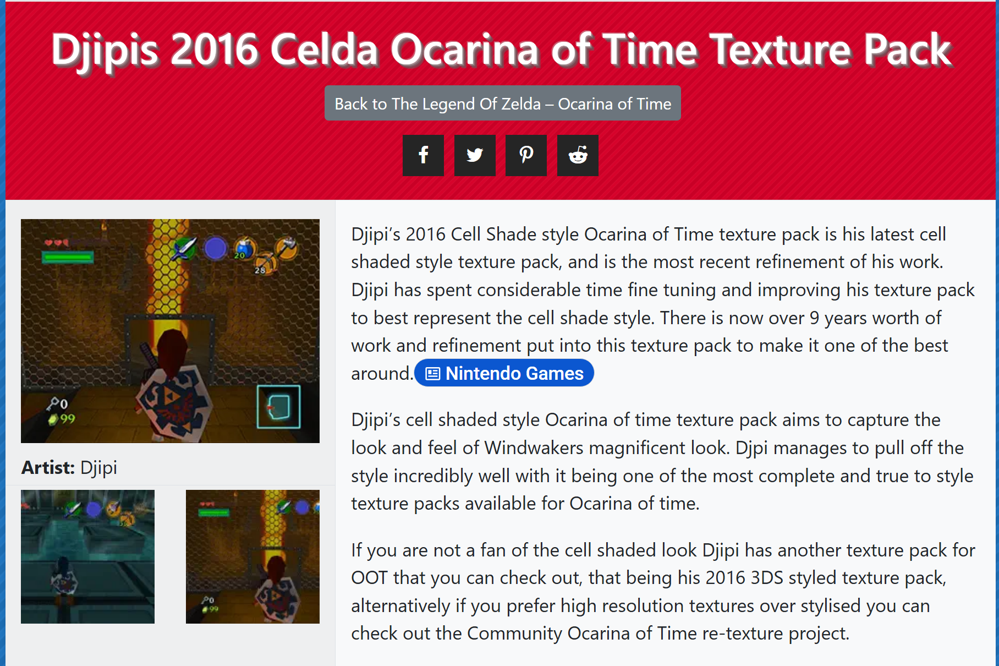

# 🪕 Rice → Ship of Harkinian Texture Pack Converter

**Play classic N64 HD texture packs — like Djipi's gorgeous Wind Waker–style "Celda" pack — inside [Ship of Harkinian](https://github.com/HarbourMasters/Shipwright), the PC port of *The Legend of Zelda: Ocarina of Time*.**

Those old texture packs were made for emulators (Mupen64 / Project64) and **don't work in Ship of Harkinian out of the box** — the two use completely different texture systems. This little Python script bridges the gap automatically.

> ## 🤖 Fastest start — let an AI do it *for* you
>
> **The single easiest path: use an AI _coding harness_.** Tools like **[Claude Code](https://www.anthropic.com/claude-code)** and **[Antigravity](https://antigravity.google)** don't just give advice — they actually *do the work on your computer*. They'll even **install Ship of Harkinian itself** for you (straight from its [official GitHub releases](https://github.com/HarbourMasters/Shipwright/releases)), set up Python and Pillow, download the script, run it, and drop the finished pack right into the game. You don't have to worry about *any* of the setup. Point one at this repo and say:
>
> > *"Read this repo and get Djipi's Celda / Wind Waker pack running in Ship of Harkinian for me, from scratch. Install Ship of Harkinian itself if I don't already have it, install whatever else is needed, run the converter, and put the finished pack in my SoH `mods/` folder. I'm a complete beginner — handle everything."*
>
> It sets up the dependencies and runs the whole thing for you, fixing any snag as it goes. That's as hands-off as it gets. 🪄
>
> **No coding harness? A regular chat AI still makes it easy.** Open a free assistant — **[ChatGPT](https://chatgpt.com)**, **[Claude](https://claude.ai)**, or **[Gemini](https://gemini.google.com)** — give it the link to this page, and say:
>
> > *"I want to convert a Rice texture pack (like Djipi's Celda / Wind Waker pack) into a Ship of Harkinian mod. Read this repo and walk me through every step on my computer — assume I'm a complete beginner with GitHub, Python, and the command line."*
>
> It can't run commands itself, but it'll translate every step to **your** exact setup and fix any error you hit — start to finish, for free.

---

## 📸 What it looks like

Djipi's "Celda" pack repaints *Ocarina of Time* in a hand-drawn, cel-shaded **Wind Waker** style — the whole world gets the treatment:



➡️ **[See more of Djipi's Celda 2016 — screenshots & download »](https://emulationking.com/nintendo/n64/games/zeldaocarinaoftime/texturepacks/djipi2016cellshade/)**

---

## 🔗 Everything you'll need (grab these first)

| | What it's for | Get it |
|---|---|---|
| 🎨 | **Djipi's "Celda" 2016 pack** — the textures themselves | **[Download here](https://emulationking.com/nintendo/n64/games/zeldaocarinaoftime/texturepacks/djipi2016cellshade/)** — choose the **"Rice Format"** download |
| 🚢 | **Ship of Harkinian** — the game you'll play it in | [Official releases](https://github.com/HarbourMasters/Shipwright/releases) |
| 🐍 | **Python 3.8+** — runs this script | [python.org/downloads](https://www.python.org/downloads/) *(on Windows, tick "Add Python to PATH" while installing)* |
| 🖼️ | **Pillow** — the image library it uses | After Python: run `pip install Pillow` |

> 🎨 **More of Djipi's work:** [2016 "Celda"](https://emulationking.com/nintendo/n64/games/zeldaocarinaoftime/texturepacks/djipi2016cellshade/) *(recommended)* · [2011 Cel Shade](https://emulationking.com/nintendo/n64/games/zeldaocarinaoftime/texturepacks/djipi2011cellshade/) · [2009 Cellshade](https://emulationking.com/nintendo/n64/games/zeldaocarinaoftime/texturepacks/djipi2009cellshade/)

> ⚠️ **Important:** Always pick the **Rice Format** version of a pack. The Glide64 / GlideN64 "cache" downloads use a different format this tool can't read. And Ship of Harkinian needs you to supply your **own legally-owned OoT ROM** (it ships no game data) — you can check your ROM at [ship.equipment](https://ship.equipment/).

---

## 🚀 Quick Start

Four steps. That's the whole thing.

### 1. Get the textures
Download Djipi's pack (**Rice Format**) and unzip it. You'll end up with a folder full of `.png` files named like `...#003334A1#3#0_all.png`.

> If the unzipped folder is named something like `[CELDA] THE LEGEND OF ZELDA`, that's fine — you'll just point the script at it in step 3.

### 2. Put the script next to the textures
Download [`rice_to_soh.py`](rice_to_soh.py) and place it in the same area as your texture folder. By default it looks for the PNGs in `./celda_rice/THE LEGEND OF ZELDA` — or you can point it anywhere with `--rice` (next step).

### 3. Run one command
Open a terminal/command prompt in the script's folder and run — just point it at your **Ship of Harkinian** folder:

```bash
python rice_to_soh.py "C:\path\to\your\Ship of Harkinian"
```

If your texture folder is somewhere else, add `--rice`:

```bash
python rice_to_soh.py "C:\path\to\Ship of Harkinian" --rice "C:\path\to\your\texture\pngs"
```

It finds every matching texture and writes **`celda.o2r`** straight into SoH's `mods/` folder. 🎉

> 💡 **Want a preview first?** Add `--dry-run` — it finishes in a few seconds and writes the report files **without** building the big (~1 GB) pack. Great for checking how much will match before committing.

### 4. Turn it on in-game
Launch **Ship of Harkinian** → press **F1** → **Mods** tab → make sure **celda** is enabled → **restart SoH**. Welcome to Wind Waker Hyrule. 🌊

---

## 🤖 Stuck? Let an AI walk you through it

Honestly, this is the perfect thing to hand to a free AI assistant (ChatGPT, Claude, Gemini — whatever you like). If a step is confusing, a command errors, or you're not sure where a folder is:

> **Copy this entire README, paste it into the AI along with whatever you're stuck on, and ask:**
> *"Walk me through this step by step for my computer — I'm a beginner."*

It'll adapt every command to your exact setup, fix classic snags like `'python' is not recognized`, and hold your hand the whole way. There's zero shame in it — that's just how a lot of this stuff gets done now. 😊

---

## 📊 What to expect (honest numbers)

Because Rice packs and Ship of Harkinian identify textures in totally different ways, **not every texture transfers — and that's expected, not a failure:**

- ✅ Roughly **62%** of the pack's textures convert and show up in-game (Link, NPCs, items, the overworld, UI, and dungeons).
- ❌ Roughly **38%** can't be matched — they have no counterpart in SoH's game data, so those spots simply stay vanilla.
- 📄 The script writes **`unmatched_rice.csv`** (everything that *didn't* make it) and **`matched.csv`** (everything that *did*) — so there's no mystery about what landed where.

> 🌍 **Works on normal *and* Master Quest.** If both `oot.o2r` (normal) and `oot-mq.o2r` (Master Quest) are in your Ship of Harkinian folder, the tool matches against both, so the resulting pack works on either version of the game.

---

## ⚙️ All the options

| Command | What it does |
|---|---|
| `python rice_to_soh.py "<SoH folder>"` | The normal way — auto-detects the base game and output location |
| `--rice "<folder>"` | Point to your Rice PNG folder if it's not the default |
| `--out "<file.o2r>"` | Choose exactly where to write the converted pack |
| `--dry-run` | Match + write the CSV reports only; skip building the big file (fast) |

### 🖱️ Prefer clicking to typing? (GUI included)

This repo also ships a point-and-click GUI — no command line at all. Install Pillow (`pip install Pillow`), then run:

```bash
python rice_to_soh_gui.py
```

Browse for your `oot.o2r` (inside your Ship of Harkinian folder), pick your texture folder, choose where to save the result, and hit convert.

> The GUI is the original **single-archive** version. For normal **and** Master Quest dual-archive matching plus the honest match-rate CSV reports, use the `python rice_to_soh.py` command shown above.

Prefer to tweak defaults instead? Open `rice_to_soh.py` in any text editor and set `SOH_DIR` near the top, then just run `python rice_to_soh.py`.

---

<details>
<summary><b>🔧 How it works (technical details — click to expand)</b></summary>

### Rice CRC Algorithm
The Rice video plugin identifies textures using `CalculateRDRAMCRC` from `FrameBuffer.cpp`. It's a custom hash (**not** standard CRC32) that operates on raw N64 RDRAM data using ROL4 + XOR + ADD accumulation.

Key technical details:
- N64 RDRAM stores data in big-endian byte order
- The CRC reads `uint32` values as big-endian (`struct.unpack('>I', ...)`)
- N64 texture pitch = `max(8, (width * bpp + 63) // 64 * 8)`

### OTR / O2R Resource Format
SoH's `.o2r` files are ZIP archives containing binary texture resources:
- **Header:** 64 bytes (endianness, isCustom, `OTEX` magic, version, ID)
- **Body (V1):** Type(u32), Width(u32), Height(u32), Flags(u32), HByteScale(f32), VPixelScale(f32), ImageDataSize(u32), ImageData(bytes)
- **Flags:** `TEX_FLAG_LOAD_AS_IMG = 0x02` tells SoH the data is raw RGBA32 pixels

### Matching Process
1. Read each texture from the base `.o2r` archive(s)
2. Compute the Rice CRC on the raw texture data (big-endian reads)
3. Match the CRC against the Rice pack's filenames
4. For matches, load the replacement PNG and convert to RGBA32
5. Pack everything into a new `.o2r` with V1-format headers

### OTR TextureType reference
| Type | Name | BPP | N64 Format | N64 Size |
|------|------|-----|------------|----------|
| 1 | RGBA32bpp | 32 | RGBA | 32b |
| 2 | RGBA16bpp | 16 | RGBA | 16b |
| 3 | Palette4bpp | 4 | CI | 4b |
| 4 | Palette8bpp | 8 | CI | 8b |
| 5 | Grayscale4bpp | 4 | I | 4b |
| 6 | Grayscale8bpp | 8 | I | 8b |
| 7 | GrayscaleAlpha4bpp | 4 | IA | 4b |
| 8 | GrayscaleAlpha8bpp | 8 | IA | 8b |
| 9 | GrayscaleAlpha16bpp | 16 | IA | 16b |

</details>

---

## ❤️ Credits
- **[Djipi](https://emulationking.com/nintendo/n64/games/zeldaocarinaoftime/texturepacks/djipi2016cellshade/)** — the beautiful cel-shaded "Celda" texture artwork
- **Rice / Mupen64Plus** — the texture CRC algorithm (`CalculateRDRAMCRC`)
- **[Ship of Harkinian](https://github.com/HarbourMasters/Shipwright) (HarbourMasters)** — the OTR/O2R resource format and the PC port that makes all this possible

*This tool only converts texture packs — it contains no game assets or copyrighted artwork. You provide your own pack and your own legally-owned game.*
